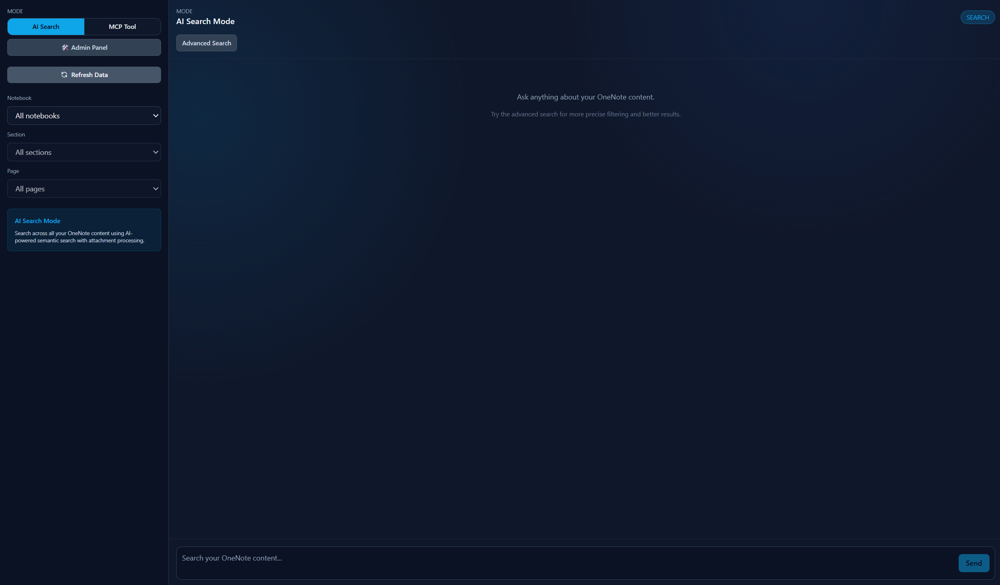
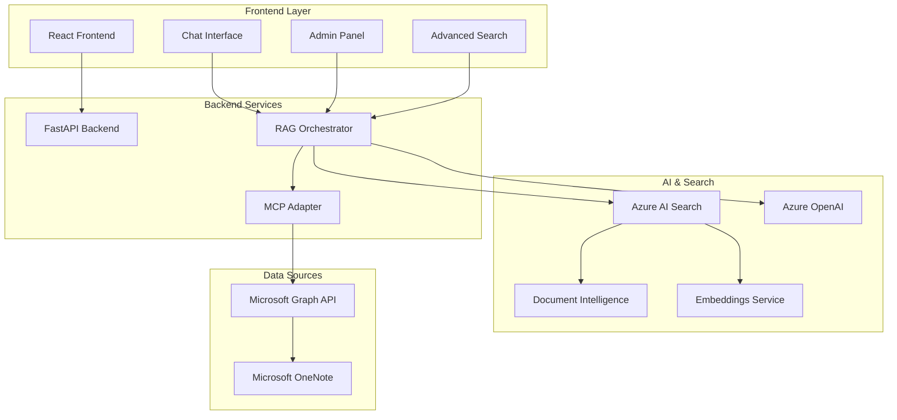

# 📓 OneNote RAG System

A sophisticated **Retrieval-Augmented Generation (RAG)** system that transforms your Microsoft OneNote content into an intelligent, searchable knowledge base using **Azure AI Search**, **Document Intelligence**, and **OpenAI GPT** models.

## 🚀 **Features**

### **🔍 Enhanced AI Search**
- **Vector Embeddings**: 1536-dimension OpenAI embeddings with HNSW algorithm  
- **Hybrid Search**: Combines semantic similarity with traditional keyword matching
- **Document Intelligence**: Automatic processing of PDF, Word, Excel, PowerPoint attachments
- **Real-time Ingestion**: Live processing of OneNote content with progress tracking
- **Cross-document Synthesis**: Intelligent analysis across multiple notebooks and sections

### **⚙️ Dual Search Interfaces**
- **Simple Search**: Conversational chat interface for natural language queries
- **Advanced Search**: Structured search with sophisticated filtering and multiple search modes

### **🛠️ Admin Interface** 
- **Real-time Ingestion Tracking**: Monitor processing status with progress indicators
- **Notebook Management**: Selective ingestion and status monitoring
- **Search Analytics**: Performance metrics and result statistics

### **🔌 MCP Integration**
- **Model Context Protocol**: Direct real-time access to OneNote content
- **Live Data**: Always up-to-date information without pre-indexing
- **Dynamic Retrieval**: Context-aware content extraction

---

## 🖼️ **Screenshots & User Interface**

### **Homepage & Authentication**
The application features a clean, modern interface with secure Azure AD authentication.


*Main landing page with navigation to different search modes*


*Secure authentication via Azure Active Directory*

### **Chat Interfaces**

#### **Simple Search Mode**
Conversational interface for natural language querying with intelligent responses and citations.


*Basic chat interface showing natural language queries and AI responses*

#### **MCP Mode Integration**  
Real-time access to OneNote content through the Model Context Protocol server.


*MCP mode providing live OneNote data access without pre-indexing*


*Graph API integration through MCP for direct OneNote connectivity*

#### **Attachment Processing**
Advanced document intelligence capabilities for processing various file formats.


*AI processing of OneNote attachments including PDFs, Office documents, and images*

### **Advanced Search Interface**
Structured search with comprehensive filtering options and multiple search algorithms.


*Advanced search interface with filtering controls, search mode selection, and detailed results*

### **Admin Panel & Management**
Real-time monitoring and management of notebook ingestion processes.


*Admin dashboard for monitoring ingestion progress, managing notebooks, and viewing system statistics*

---

## 🏗️ **Architecture**



---

## 🔄 **Data Flow**

### **Search Mode Flow**
1. **User Query** → Frontend captures natural language question
2. **Vector Embedding** → Azure OpenAI converts query to 1536-dim vector
3. **Hybrid Search** → Azure AI Search finds relevant content using:
   - Vector similarity matching
   - BM25 keyword scoring  
   - Semantic reranking
4. **Context Building** → Retrieved chunks formatted with source metadata
5. **LLM Generation** → Azure OpenAI generates intelligent response
6. **Response Delivery** → Answer with citations returned to user

### **MCP Mode Flow**  
1. **Scope Definition** → User selects notebooks/sections/pages
2. **Real-time Extraction** → MCP server fetches live OneNote content
3. **Content Aggregation** → Multiple pages combined with metadata
4. **LLM Processing** → OpenAI analyzes full context for comprehensive answers
5. **Citation Generation** → Source references with direct OneNote links

### **Ingestion Flow**
1. **Notebook Selection** → Admin chooses OneNote notebooks for processing
2. **Content Extraction** → Microsoft Graph API retrieves pages and attachments
3. **Document Intelligence** → Azure AI processes attachments (PDF, Office docs, images)
4. **Chunking Strategy** → Content split using semantic paragraph boundaries
5. **Vector Generation** → OpenAI embeddings created for each chunk  
6. **Index Storage** → Azure AI Search stores vectors with rich metadata
7. **Status Tracking** → Real-time progress updates in admin interface

---

## 🎯 **Search Modes Explained**

### **💬 Simple Search (Conversational)**

**Interface**: Chat-style message history with natural language input

**Features**:
- 🗨️ **Conversational Flow**: Back-and-forth Q&A with context retention
- 🎯 **Fixed Hybrid Mode**: Automatically uses best-performing search algorithm
- 📍 **Sidebar Filtering**: Scope to specific notebooks/sections via UI controls
- 🚀 **Quick Access**: Just type and send for immediate results

**Best For**:
- Exploratory questions ("What's our Q1 strategy?")
- Follow-up conversations ("Tell me more about that budget")
- General content browsing
- Natural language queries

**API**: `POST /chat`

### **⚙️ Advanced Search (Structured)**

**Interface**: Rich filtering controls with multiple search strategies

**Search Algorithms**:
- 🔄 **Hybrid**: Vector similarity + keyword matching + semantic reranking
- 🧠 **Semantic**: Pure vector similarity for conceptual matching  
- 🔤 **Simple**: Traditional keyword-based BM25 scoring
- 📚 **Full**: Complete Azure Search feature set with advanced operators

**Advanced Filters**:
- 📚 **Notebook Selection**: Choose specific notebooks to search
- 📄 **Content Types**: Filter between page text vs. attachments
- 📎 **File Types**: Target specific formats (.pdf, .docx, .xlsx, .pptx)
- 📅 **Date Ranges**: Time-based content filtering  
- 🔗 **Attachment Status**: Content with or without attachments
- 💡 **Auto-suggestions**: Query completion based on indexed content

**Best For**:
- Precision searches requiring specific filters
- Document type targeting ("Find all PDFs from last quarter")
- Comparative analysis of search algorithms
- Time-based content analysis
- Attachment-focused queries

**API**: `POST /search/advanced`

---

## 🔧 **Technical Stack**

### **Backend**
- **FastAPI**: High-performance async API framework
- **Python 3.11+**: Core application runtime
- **Azure SDK**: Integration with Azure services
- **Pydantic**: Data validation and serialization
- **HTTPx**: Async HTTP client with connection pooling

### **Frontend**  
- **React 18**: Modern component-based UI
- **TypeScript**: Type-safe development
- **Tailwind CSS**: Utility-first styling
- **SWR**: Data fetching and caching
- **Azure MSAL**: Authentication integration

### **Azure Services**
- **Azure AI Search**: Vector search and content indexing
- **Azure OpenAI**: GPT models and embeddings (text-embedding-ada-002)
- **Azure Document Intelligence**: Attachment processing and OCR
- **Microsoft Graph API**: OneNote content access
- **Azure Key Vault**: Secure credential management

### **Search Technology**
- **HNSW Algorithm**: Approximate nearest neighbor vector search
- **BM25 Scoring**: Probabilistic keyword ranking
- **Semantic Reranking**: Cross-encoder relevance scoring
- **1536-dimension Embeddings**: High-fidelity content representation

---

## 🛠️ **Setup & Installation**

### **Prerequisites**
- **Azure Subscription** with AI Services enabled
- **Microsoft 365** with OneNote access
- **Node.js 18+** and **Python 3.11+**
- **Azure CLI** for resource deployment

### **1. Infrastructure Deployment**
```bash
# Deploy Azure resources using Bicep
cd infra
az deployment group create \
  --resource-group your-rg \
  --template-file main.bicep \
  --parameters @parameters.json
```

### **2. Backend Configuration**
```bash
# Navigate to backend
cd backend

# Install dependencies  
pip install -r requirements.txt

# Configure environment variables
cp .env.example .env
# Edit .env with your Azure service endpoints and keys

# Start the API server
uvicorn app.main:app --reload --port 8000
```

### **3. MCP Server Setup**
```bash  
# Navigate to MCP server
cd mcp-server

# Install dependencies
pip install -r requirements.txt

# Start MCP server
python app/main.py --port 3000
```

### **4. Frontend Development**
```bash
# Navigate to frontend
cd frontend  

# Install dependencies
npm install

# Configure environment variables
cp .env.example .env.local
# Add your Azure AD app registration details

# Start development server  
npm run dev
```

### **5. Initial Data Ingestion**
```bash
# Access admin panel at http://localhost:5173
# Navigate to Admin tab
# Select notebooks for ingestion
# Monitor progress in real-time
```

---

## 📖 **API Reference**

### **Chat Endpoints**

#### `POST /chat`
Conversational search with message history support.

```json
{
  "message": "What is the budget for the Acme Corp project?",
  "mode": "search",
  "notebook_id": "optional-notebook-filter",
  "search_mode": "hybrid"
}
```

**Response**:
```json
{
  "answer": "Based on OneNote, the budget for the Acme Corp integration project is $285,000...",
  "citations": [...],
  "mode": "search",
  "search_mode": "hybrid",
  "total_results": 5
}
```

#### `POST /search/advanced` 
Structured search with comprehensive filtering options.

```json
{
  "query": "quarterly budget analysis",
  "search_mode": "semantic",
  "filters": {
    "notebook_ids": ["notebook-1", "notebook-2"], 
    "content_types": ["attachment"],
    "date_range": {"start": "2024-01-01", "end": "2024-12-31"},
    "attachment_types": ["pdf", "xlsx"]
  }
}
```

### **Admin Endpoints**

#### `GET /admin/stats`
Retrieve system statistics and search index information.

#### `POST /ingestion`  
Start notebook ingestion with real-time progress tracking.

#### `GET /admin/ingestion-jobs`
Monitor active and completed ingestion jobs.

---

## 🔐 **Security & Authentication**

### **Azure AD Integration**
- **MSAL Authentication**: Secure token-based access
- **On-behalf-of Flow**: Server-side token exchange
- **Scoped Permissions**: Granular OneNote access control

### **API Security** 
- **Bearer Token Validation**: JWT token verification
- **CORS Configuration**: Cross-origin request handling
- **Rate Limiting**: API abuse prevention

### **Data Privacy**
- **No Content Storage**: MCP mode accesses live data only 
- **Encrypted Transit**: HTTPS/TLS for all communications
- **Azure Key Vault**: Secure credential management

---

## 📊 **Performance & Monitoring**

### **Search Performance**
- **Vector Query Time**: ~200-500ms for semantic search
- **Hybrid Search**: ~300-800ms combining multiple algorithms
- **Result Relevance**: Semantic reranking for improved accuracy
- **Concurrent Users**: Async architecture supports multiple simultaneous queries

### **Ingestion Metrics**
- **Processing Speed**: ~50-100 pages per minute
- **Attachment Processing**: Variable based on document complexity
- **Index Size**: Approximately 2-3KB per content chunk
- **Vector Dimensions**: 1536 per embedding (OpenAI standard)

### **Monitoring Tools**
- **Application Insights**: Request tracing and performance metrics
- **Azure Monitor**: Resource utilization and health checks
- **Real-time Dashboards**: Admin panel with live status updates

---

## 🚀 **Usage Examples**

### **Basic Factual Queries**
```
"What is the budget for the Acme Corp integration project?"
→ Returns: $285,000 with meeting notes citations
```

### **Cross-Document Analysis**  
```
"Compare the technical requirements between Acme Corp and TechStart projects"
→ Synthesizes information from multiple project documents
```

### **Timeline Tracking**
```
"What progress have we made on the microservices migration since Q1 2026?"
→ Aggregates status updates across sprint retrospectives
```

### **Attachment-Focused Search**
Advanced Search → Filter: Content Type = Attachments, File Type = .pdf
Query: "budget spreadsheets"
→ Returns only PDF attachments containing budget information

---

## 🔧 **Development**

### **Project Structure**
```
onenote/
├── backend/           # FastAPI application
│   ├── app/          # Core application modules
│   ├── tests/        # Unit and integration tests  
│   └── requirements.txt
├── frontend/          # React application
│   ├── src/          # UI components and logic
│   └── package.json
├── mcp-server/        # Model Context Protocol server
├── infra/            # Bicep infrastructure templates
├── docs/             # Additional documentation
└── sample/           # Test data and questions
```

### **Key Components**

#### **RAG Orchestrator** (`backend/app/rag_orchestrator.py`)
Central coordination of search modes, LLM integration, and response generation.

#### **Search Client** (`backend/app/search_client.py`)  
Azure AI Search integration with vector query management and filtering.

#### **MCP Adapter** (`backend/app/mcp_adapter.py`)
Model Context Protocol implementation for real-time OneNote access.

#### **Admin Panel** (`frontend/src/components/AdminPanel.tsx`)
Real-time ingestion monitoring and system management interface.

### **Testing Strategy**
- **Unit Tests**: Core logic validation  
- **Integration Tests**: Azure service connectivity
- **End-to-End Tests**: Full user workflow validation
- **Test Questions**: 50+ curated queries for system validation (see `sample/test-questions.md`)

---

## 📋 **Troubleshooting**

### **Common Issues**

**No Search Results**
- Verify Azure AI Search index contains data
- Check search service key and endpoint configuration
- Ensure proper authentication tokens

**MCP Connection Errors**  
- Confirm MCP server is running on port 3000
- Validate Microsoft Graph API permissions
- Check Azure AD app registration scopes

**Slow Search Performance**
- Monitor Azure Search service tier and scaling
- Review query complexity and filter efficiency
- Check network latency to Azure services

**Ingestion Failures**
- Verify OneNote permissions and access tokens
- Check Document Intelligence service limits
- Monitor Azure service quotas and throttling

### **Debug Mode**
Enable detailed logging by setting environment variables:
```bash
export LOG_LEVEL=DEBUG
export AZURE_LOG_LEVEL=DEBUG
```

---

## 🤝 **Contributing**

### **Development Workflow**
1. Fork the repository
2. Create feature branch (`git checkout -b feature/amazing-feature`)
3. Implement changes with tests
4. Commit using conventional commits  
5. Push and create pull request

### **Code Standards**
- **Python**: Follow PEP 8, use type hints
- **TypeScript**: Strict mode enabled, ESLint configuration
- **Testing**: Maintain >80% code coverage
- **Documentation**: Update README for architectural changes

---

## 📄 **License**

This project is licensed under the MIT License - see the LICENSE file for details.

---

## 🙋‍♂️ **Support**

For questions, issues, or contributions:
- **Issues**: GitHub Issues for bug reports and feature requests
- **Discussions**: GitHub Discussions for questions and ideas  
- **Security**: Report security vulnerabilities privately

---

*Built with ❤️ using Azure AI Services, OpenAI, and Microsoft Graph*